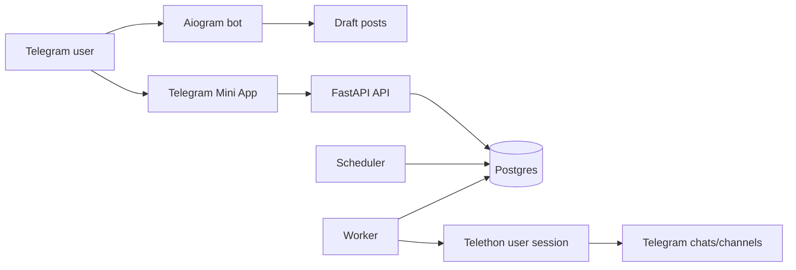

# Autopost Manager

Telegram-first сервис для автопостинга в группы и каналы через пользовательские
Telegram-аккаунты. Пользователь готовит пост прямо в чате с ботом, открывает
Mini App, выбирает время, повторы и целевые чаты, а backend ставит задания в
очередь и отправляет их через MTProto-сессии.

Проект сейчас сфокусирован на MVP для управления постингом в "Барахолки".
`n8n` намеренно не входит в основной контур: при необходимости его можно
подключить позже как внешнюю интеграцию через HTTP API.

## Возможности

### Бизнес-функции

- Подключение Telegram-аккаунта из Mini App по номеру телефона, коду Telegram и
  паролю 2FA, если он включён.
- Создание черновиков из сообщений боту: текст, фото, видео, анимации,
  документы и Telegram-альбомы.
- Сохранение HTML-форматирования из Telegram-сообщений.
- Выбор целевых групп и каналов из синхронизированных Telegram-диалогов.
- Поддержка Telegram-папок: можно фильтровать список чатов по папкам аккаунта.
- Поиск, пагинация и сортировка выбранных чатов первыми.
- Планирование постов:
  - один раз;
  - каждые N минут;
  - каждый день;
  - по будням;
  - по выходным;
  - через день;
  - по выбранным дням недели.
- Очередь запланированных постов с редактированием, паузой и возобновлением.
- Глобальная пауза автопостинга по аккаунту.
- Отключение Telegram-сессии с отменой pending jobs и скрытием данных
  пользователя из Mini App.
- Удаление черновиков и постов с best-effort удалением исходных сообщений в
  чате с ботом.
- История отправок в разделе "Аудит": статус, попытки, целевой чат,
  `telegram_message_id` и ошибка, если отправка не прошла.
- Админка для пользователей из `ADMIN_TELEGRAM_IDS`:
  - список пользователей с поиском и пагинацией;
  - бан пользователя;
  - остановка автопостинга пользователя;
  - дневной лимит успешных отправок;
  - общая статистика отправок.
- Ручная постановка поста в очередь через API `enqueue-now`.

### Защита от рискованной отправки

- Минимальный интервал повторяющихся постов: 20 минут.
- Для интервалов до 30 минут требуется явное подтверждение риска спама.
- Между реальными отправками одной Telegram-сессии выдерживается
  `min_send_interval_seconds` (по умолчанию 30 секунд).
- Отправки одной сессии защищены lock-файлом и `asyncio.Lock`, чтобы не писать
  в одну MTProto-сессию параллельно.
- При выборе больше 15 чатов Mini App показывает предупреждение о риске
  блокировки аккаунта.
- `FloodWaitError` помечает сессию как `limited`, а ошибка сохраняется в job.

## Архитектура



Компоненты:

- `bot` принимает сообщения от пользователя, создаёт черновики и открывает
  Mini App.
- `api` обслуживает Mini App, хранит настройки, сессии, посты, цели и jobs.
- `scheduler` периодически ищет due posts и создаёт `PublishJob` на каждый
  целевой чат.
- `worker` забирает pending jobs, выбирает активную сессию и отправляет пост.
- `postgres` хранит все доменные данные.
- `miniapp` - статический Telegram Web App, который отдаётся FastAPI.

## Технологии

- Python 3.12+
- FastAPI
- SQLAlchemy 2
- PostgreSQL 17
- Aiogram 3
- Telethon
- Docker Compose
- Vanilla HTML/CSS/JS для Mini App
- Pytest + Ruff для разработки

## Быстрый старт

### 1. Требования

- Docker и Docker Compose.
- Python 3.12+ для локальных тестов без Docker.
- Telegram bot token из BotFather.
- `api_id` и `api_hash` из [my.telegram.org](https://my.telegram.org).

### 2. Настройте окружение

```bash
cp .env.example .env
```

Заполните минимум:

```dotenv
APP_SECRET=replace_with_long_random_secret
BOT_TOKEN=replace_with_botfather_token
TELEGRAM_API_ID=123456
TELEGRAM_API_HASH=replace_with_my_telegram_org_hash
```

Для локального запуска значения `APP_BASE_URL` и `MINI_APP_URL` из
`.env.example` уже подходят:

```dotenv
APP_BASE_URL=http://localhost:8000
MINI_APP_URL=http://localhost:8000/miniapp/
```

### 3. Поднимите сервисы

```bash
docker compose up --build
```

Проверьте API:

```bash
curl http://localhost:8000/health
```

Ожидаемый ответ:

```json
{"ok":true,"env":"local"}
```

### 4. Откройте Mini App

В production Mini App открывается через кнопку в Telegram-боте.
Локально статическую страницу можно открыть по адресу:

```text
http://localhost:8000/miniapp/
```

Для полноценной авторизации Mini App отправляет Telegram WebApp init data.
Обычный браузер полезен для визуальной проверки, но защищённые API-запросы без
Telegram-контекста будут отклонены.

### 5. Подключите Telegram-аккаунт

В Mini App:

1. Введите номер телефона.
2. Подтвердите код из Telegram.
3. Если Telegram попросит, введите пароль 2FA.
4. После подключения сервис синхронизирует доступные группы и каналы.

Альтернативно для служебного создания сессии есть CLI:

```bash
docker compose run --rm worker autopost-login-session "Main Account" "+10000000000"
```

## Основной пользовательский сценарий

1. Пользователь пишет `/start` боту.
2. Бот показывает кнопку открытия панели.
3. Пользователь отправляет готовый пост в чат с ботом.
4. Бот сохраняет сообщение как черновик.
5. Пользователь открывает Mini App, выбирает черновик.
6. Пользователь выбирает дату, тип расписания и целевые чаты.
7. API переводит пост в `scheduled`.
8. Scheduler создаёт `PublishJob` для каждого целевого чата, когда наступает
   `next_run_at`.
9. Worker отправляет jobs через Telethon и пишет результат в аудит.

## Переменные окружения

| Переменная | Назначение | Значение по умолчанию |
| --- | --- | --- |
| `APP_ENV` | Имя окружения для health/status | `local` |
| `APP_BASE_URL` | Базовый URL backend | `http://localhost:8000` |
| `MINI_APP_URL` | URL Telegram Mini App | `http://localhost:8000/miniapp/` |
| `APP_SECRET` | Секрет приложения | нет |
| `API_BIND` | Host bind для Docker port mapping | `0.0.0.0` |
| `API_PORT` | Внешний порт API | `8000` |
| `BOT_TOKEN` | Token Telegram-бота из BotFather | нет |
| `BOT_USERNAME` | Username бота без обязательного `@` | `scheduler_baraholki_bot` |
| `ADMIN_TELEGRAM_IDS` | Telegram ID администраторов через запятую | пусто |
| `TELEGRAM_API_ID` | Telegram API ID для MTProto | нет |
| `TELEGRAM_API_HASH` | Telegram API hash для MTProto | нет |
| `TELEGRAM_SESSIONS_DIR` | Каталог session-файлов | `/data/sessions` |
| `DATABASE_URL` | SQLAlchemy URL Postgres | compose Postgres |
| `SCHEDULER_TICK_SECONDS` | Частота прохода scheduler | `15` |
| `WORKER_TICK_SECONDS` | Пауза worker, когда очередь пуста | `5` |
| `DEFAULT_MIN_SEND_INTERVAL_SECONDS` | Минимальная пауза между отправками сессии | `30` |

Не коммитьте реальные `.env`, BotFather tokens, Telegram `api_hash`,
session strings или `*.session` файлы.

## Команды разработки

Создать виртуальное окружение и установить dev-зависимости:

```bash
python3 -m venv .venv
.venv/bin/pip install -e '.[dev]'
```

Запустить тесты:

```bash
PYTHONPATH=src .venv/bin/python -m pytest
```

Запустить тесты с coverage:

```bash
PYTHONPATH=src .venv/bin/python -m pytest --cov=autopost_manager --cov-report=term-missing
```

Проверить JavaScript Mini App:

```bash
node --check miniapp/app.js
```

Проверить стиль Python:

```bash
.venv/bin/ruff check src tests
```

Локально поднять весь стек:

```bash
docker compose up --build
```

Пересобрать только API:

```bash
docker compose up -d --build api
```

## API-обзор

Публичные endpoints:

- `GET /health`
- `GET /api/health`

Основные защищённые endpoints Mini App:

- `GET /api/app-config`
- `GET /api/user-settings`
- `GET /api/sessions`
- `POST /api/account/start-login`
- `POST /api/account/confirm-code`
- `POST /api/account/confirm-password`
- `POST /api/account/pause`
- `POST /api/account/resume`
- `POST /api/account/logout`
- `POST /api/account/revoke-session`
- `POST /api/sessions/{session_id}/sync-chats`
- `GET /api/chats`
- `GET /api/folders`
- `POST /api/chats`
- `GET /api/posts`
- `POST /api/posts`
- `POST /api/posts/{post_id}/schedule`
- `PATCH /api/posts/{post_id}/pause`
- `PATCH /api/posts/{post_id}/resume`
- `DELETE /api/posts/{post_id}`
- `POST /api/posts/{post_id}/enqueue-now`
- `GET /api/jobs`
- `GET /api/audit`
- `GET /api/admin/users`
- `PATCH /api/admin/users/{telegram_user_id}`
- `GET /api/admin/stats`

Защищённые endpoints требуют заголовок:

```http
X-Telegram-Init-Data: <Telegram WebApp initData>
```

Подпись проверяется в `autopost_manager.security`.

## Модель данных

Ключевые сущности:

- `UserSettings` - пользовательские настройки, включая глобальную паузу.
- `TelegramSession` - подключённый Telegram-аккаунт и MTProto-сессия.
- `TargetChat` - группа, супергруппа или канал для отправки.
- `Post` - черновик или запланированный пост.
- `PostTarget` - связь поста с целевыми чатами.
- `PostMedia` - медиа из Telegram-сообщений.
- `PublishJob` - конкретная отправка конкретного поста в конкретный чат.

Статусы:

- `PostStatus`: `draft`, `scheduled`, `paused`, `archived`.
- `JobStatus`: `pending`, `processing`, `done`, `failed`, `cancelled`.
- `SessionStatus`: `credentials_needed`, `code_needed`, `password_needed`,
  `needs_login`, `active`, `paused`, `limited`, `revoked`.

## Scheduler и Worker

Scheduler:

- выбирает `scheduled` posts с `next_run_at <= now`;
- пропускает пользователей с глобальной паузой;
- создаёт отдельный `PublishJob` на каждый целевой чат;
- для `once` переводит пост в `archived`;
- для повторов переносит `next_run_at` вперёд.

Worker:

- берёт один pending job за раз;
- выбирает явную session из job или активную session владельца с самым старым
  `last_send_at`;
- проверяет, что автопостинг не поставлен на паузу;
- отправляет текст или медиа через Telethon;
- учитывает `min_send_interval_seconds`;
- сохраняет `telegram_message_id` или `last_error`.

## Production deploy

Текущий production запускается Docker Compose стеком. Базовый безопасный порядок:

```bash
git pull --ff-only
docker compose up -d --build api
docker compose restart bot scheduler worker
docker compose ps
curl -fsS http://127.0.0.1:8000/health
```

Если менялись только файлы `miniapp`, всё равно полезно пересоздать `api`, потому
что Mini App и монтируется volume-ом, и копируется в Docker image. После
изменения `miniapp/app.js` или `miniapp/styles.css` обновляйте cache-bust версию
в `miniapp/index.html`.

## Contribution Guide

### Принципы

- Держите изменения маленькими и проверяемыми.
- Не смешивайте продуктовую правку, рефакторинг и форматирование в одном PR.
- Сохраняйте существующие паттерны проекта: FastAPI handlers в `api.py`, доменная
  модель в `models.py`, Telegram/Telethon-интеграции в `telegram_client.py`.
- Все пользовательские данные должны быть scoped по `created_by_telegram_id` или
  `owner_telegram_id`.
- Любой endpoint, который меняет очередь или аккаунт, должен уважать глобальную
  паузу и активность Telegram-сессии.
- Не добавляйте обходы антиспам-проверок без отдельного обсуждения.

### Перед коммитом

```bash
node --check miniapp/app.js
PYTHONPATH=src .venv/bin/python -m pytest
.venv/bin/ruff check src tests
```

Если правка затрагивает только Mini App, минимум:

```bash
node --check miniapp/app.js
PYTHONPATH=src .venv/bin/python -m pytest tests/test_miniapp_static.py
```

### Что тестировать

- API validation и ownership checks - `tests/test_api.py`.
- Scheduler transitions - `tests/test_scheduler.py`.
- Worker job processing - `tests/test_worker.py`.
- Telethon behavior and error classification - `tests/test_telegram_client.py`.
- Bot draft creation - `tests/test_bot.py`.
- Mini App static contract - `tests/test_miniapp_static.py`.
- Telegram WebApp auth signature - `tests/test_security.py`.

### Git workflow

1. Создайте ветку от `main`.
2. Внесите изменение.
3. Добавьте или обновите тесты.
4. Прогоните релевантные проверки.
5. Сделайте понятный commit message в imperative style.
6. Откройте PR с описанием:
   - что изменилось;
   - как проверить;
   - есть ли миграции, env vars или deploy notes.

## Безопасность

- Реальные секреты должны жить только в `.env` или secret storage.
- Telegram WebApp init data проверяется на подпись и возраст.
- Пользователь видит только свои сессии, чаты, посты и jobs.
- При `revoke-session` сервис пытается закрыть Telegram-сессию, удаляет session
  string и файлы, отключает чаты и отменяет pending jobs.
- Удаление сообщений в Telegram делается best-effort: если пользовательская
  сессия не смогла удалить, используется fallback через bot API там, где это
  возможно.

## Troubleshooting

### `ModuleNotFoundError: No module named 'autopost_manager'`

Запускайте тесты с `PYTHONPATH=src` или установите пакет editable:

```bash
.venv/bin/pip install -e '.[dev]'
PYTHONPATH=src .venv/bin/python -m pytest
```

### Mini App не видит новый JS/CSS

Проверьте cache-bust версию в `miniapp/index.html`:

```html
<link rel="stylesheet" href="styles.css?v=YYYYMMDD-N" />
<script src="app.js?v=YYYYMMDD-N"></script>
```

После изменения версии перезапустите `api` контейнер.

### Telegram просит повторный логин

Сессия могла стать `needs_login`, `limited` или `revoked`. Проверьте:

```bash
docker compose logs worker api bot
```

Затем переподключите аккаунт через Mini App.

### Worker пишет `FloodWait`

Telegram ограничил частоту действий. Сессия помечается `limited`, ошибка
сохраняется в job. Уменьшите частоту постинга, увеличьте
`DEFAULT_MIN_SEND_INTERVAL_SECONDS` для новых сессий или обновите значение
`min_send_interval_seconds` у существующей сессии в базе.

## Структура проекта

```text
.
├── miniapp/                 # Telegram Mini App: HTML/CSS/JS
├── scripts/                 # Operational scripts and notes
├── src/autopost_manager/
│   ├── api.py               # FastAPI app and HTTP endpoints
│   ├── bot.py               # Aiogram bot and draft ingestion
│   ├── config.py            # Pydantic settings
│   ├── db.py                # SQLAlchemy engine/session/schema bootstrap
│   ├── models.py            # ORM models and enums
│   ├── scheduler.py         # Due post scheduler
│   ├── security.py          # Telegram WebApp init data validation
│   ├── session_login.py     # CLI helper for session login
│   ├── telegram_client.py   # Telethon integration
│   └── worker.py            # Publish job worker
├── tests/                   # Unit and integration-style tests
├── docker-compose.yml
├── Dockerfile
└── pyproject.toml
```
